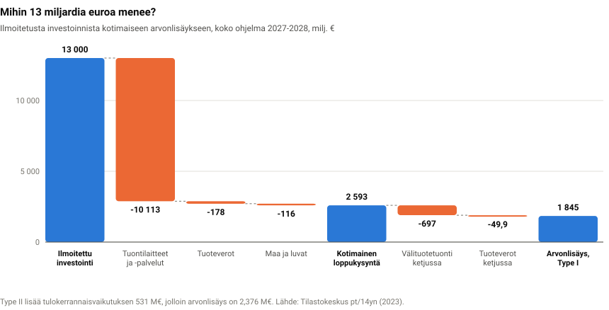
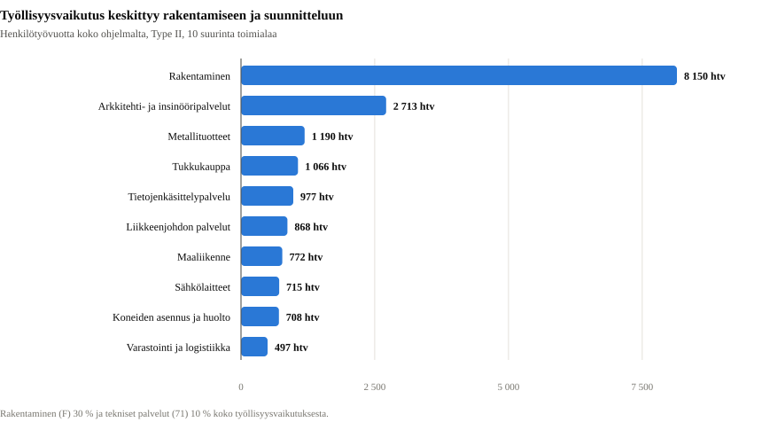
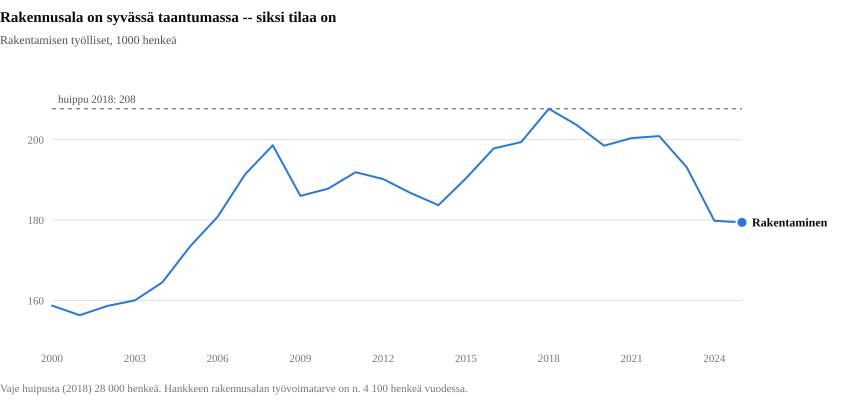
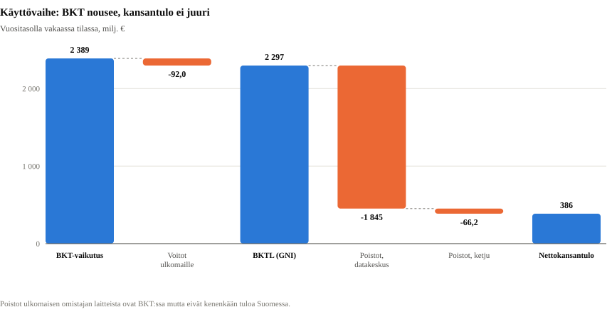
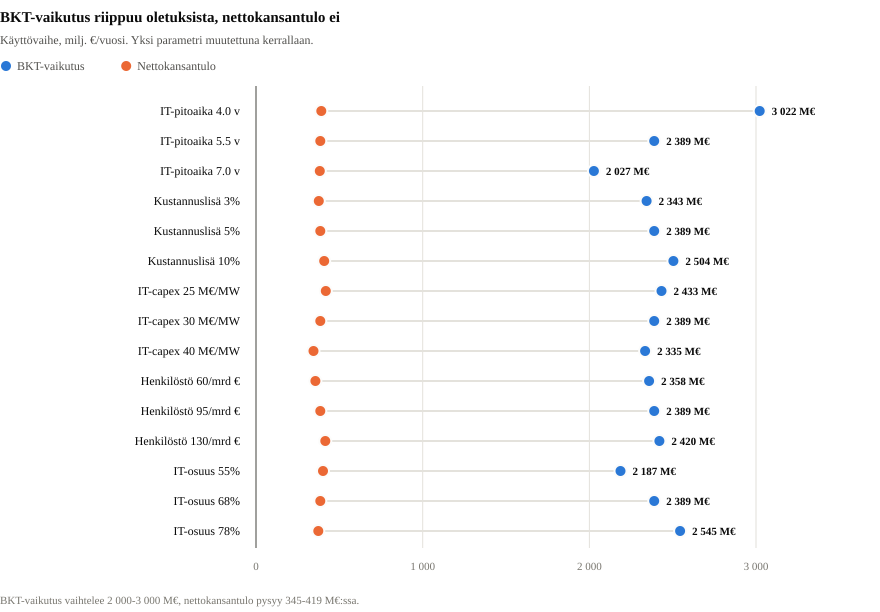
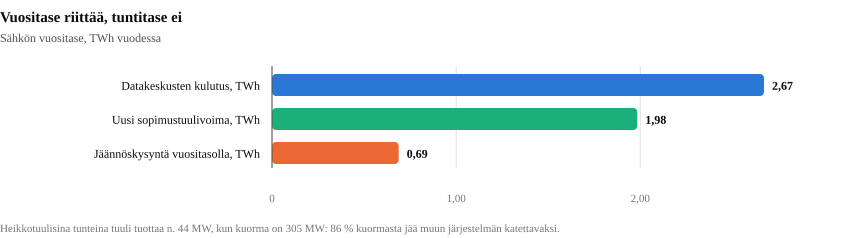
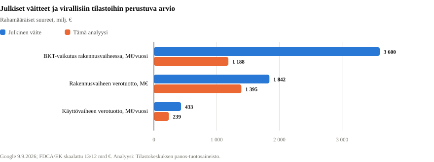
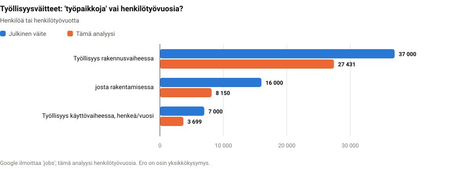

# Datakeskusinvestoinnin kansantaloudelliset vaikutukset

**Esimerkkitapaus: Googlen 13 miljardin euron investointi Suomeen 2027–2028**

*Analyysi perustuu Tilastokeskuksen virallisiin aineistoihin. Kaikki laskelmat
ovat toisinnettavissa tämän repositorion koodilla.*

---

## 1. Tiivistelmä

Google ilmoitti 9.9.2026 investoivansa Suomeen vähintään 13 miljardia euroa
kahden vuoden aikana (2027–2028) tekoälyinfrastruktuuriin Haminassa, Kajaanissa,
Muhoksella ja Vaalassa. Kyse on Suomen historian suurimmasta yksittäisestä
investoinnista: 6,5 mrd € vuodessa vastaa **10,5 prosenttia koko Suomen
kiinteän pääoman bruttomuodostuksesta** (61,7 mrd €, 2025).

Tämä analyysi laskee vaikutukset viidellä toisistaan riippumattomalla
lähestymistavalla. Keskeiset tulokset:

**1. Investoinnin koko ei ole sen vaikutus. Noin 80 prosenttia rahasta menee
maasta ulos välittömästi.** Tekoälydatakeskuksen investointimenoista noin
kaksi kolmasosaa on palvelimia ja kiihdyttimiä, joita Suomessa ei valmisteta.
13 miljardista euroa jää kotimaiseksi loppukysynnäksi **2 593 miljoonaa euroa
(19,9 %)**; loput 10,1 mrd € on suoraa tuontia, 178 M€ tuoteveroja ja 116 M€
maakauppoja, jotka eivät ole tuotantoa lainkaan.

**2. Rakennusvaiheen BKT-vaikutus on noin 1,2 mrd € vuodessa eli 0,42 % BKT:sta
— kolmasosa yhtiön ilmoittamasta.** Google ilmoittaa keskimäärin 3,6 mrd €
vuodessa. Tilastokeskuksen panos-tuotostaulukolla laskettu arvonlisäys on
kerrannaisvaikutukset mukaan lukien 2 376 M€ koko ohjelmalta, siis 1 188 M€
vuodessa. Ero syntyy lähes kokonaan tuontisisällöstä.

**3. Työllisyysvaikutus on 27 400 henkilötyövuotta koko ohjelmalta**, eli
keskimäärin 13 700 henkeä vuodessa 2027 ja 2028. Yhtiön luku 37 000 "työpaikkaa"
on samaa suuruusluokkaa, jos sillä tarkoitetaan työsuhteiden lukumäärää eikä
henkilötyövuosia; rakentamisen 16 000 työpaikkaa sen sijaan edellyttäisi
rakennustuotoksen lisäystä, joka on kaksinkertainen tämän analyysin arvioon.

**4. Ajoitus on hyvä: rakennusalalla on aitoa vapaata kapasiteettia.**
Työttömyysaste oli 2025 keskimäärin 9,7 % ja rakentamisen työllisyys 179 400
henkeä eli 28 300 vähemmän kuin huippuvuonna 2018. Hankkeen suora
rakennustyövoiman tarve on noin 4 100 henkeä vuodessa. Estimoimme
rakentamisen palkkareaktion neljännesvuosiaineistosta: tuntien 1 prosentin
kasvu nostaa alan suhteellista ansiotasoa 0,025 %-yksikköä (HAC t = 1,9).
Hankkeen mittaluokassa tämä on 0,05 %-yksikköä — syrjäytymisvaikutus
palkkakanavan kautta on käytännössä olematon.

**5. Tärkein havainto: käyttövaiheessa BKT nousee 0,85 %, mutta
nettokansantulo vain 0,14 %.** Kun kampus on käynnissä, sen Suomeen kirjautuvan
arvonlisäyksen suurin erä on **ulkomaisessa omistuksessa olevien laitteiden
poistot, 1 845 M€ vuodessa — 77 prosenttia koko BKT-vaikutuksesta**. Poistot
ovat BKT:ssa mutta ne eivät ole kenenkään tuloa Suomessa. Kun ne ja voittojen
vienti vähennetään, jäljelle jää 386 M€ vuodessa. Tämä havainto on erittäin
robusti: BKT-vaikutus vaihtelee oletuksista riippuen 2 000–3 000 M€, mutta
nettokansantulo pysyy 345–419 M€:ssa. Suomi on saamassa lievän version
Irlannin BKT-ongelmasta, jonka vuoksi Irlanti joutui kehittämään oman
GNI\*-mittarin.

**6. Sähkö: vuositase riittää, tuntitase ei.** Kampuksen kulutus on noin
2,7 TWh eli 3,2 % Suomen sähkönkulutuksesta, keskiteholtaan 305 MW. Googlen
sopima uusi tuulivoima (629 MW) tuottaa vuositasolla 2,0 TWh, joten
vuosijäännös on vain 0,7 TWh. Mutta datakeskus on tasakuormaa ja tuuli ei:
heikkotuulisina tunteina — jotka ovat juuri hinnan asettavia tunteja — tuuli
tuottaa noin 44 MW, kun kuorma on 305 MW. **86 prosenttia kuormasta jää
tällöin muun järjestelmän katettavaksi.** Vuositason hintavaikutus on
0,5–1,5 €/MWh, mikä siirtää kuluttajilta tuottajille 38–128 M€ vuodessa.
Kansantaloudellinen hyvinvointitappio on tätä pienempi: kyse on
pääosin tulonsiirrosta, ei tehokkuustappiosta.

**7. Julkinen talous: rakennusvaiheessa 1,1–1,5 mrd €, käyttövaiheessa
239 M€ vuodessa — ja suurin yksittäinen erä on sähkövero.** Yhteisöveroa
kertyy vähän: Googlen suomalainen yhtiö Tuike Finland Oy maksoi vuonna 2022
yhteisöveroa 8,9 M€ (verotettava tulo 44,4 M€) ja vuosina 2024–2025 ei
lainkaan, koska investoinnit tuottivat poistoja. Rakenne on
kustannusvoittolisä­palvelu, ei voittokeskus. Sen sijaan datakeskusten siirto
sähköveroluokasta II luokkaan I 1.7.2026 nosti tämän kuorman sähköveron
3,6 M€:sta 62,1 M€:oon vuodessa — **veroluokkamuutos on valtiolle
58,5 M€ vuodessa arvokkaampi kuin koko hankkeen yhteisövero**.

### Yhteenvetotaulukko

| Suure | Rakennusvaihe 2027–2028 | Käyttövaihe (vakaa tila) |
|---|---|---|
| Ilmoitettu investointi | 6 500 M€/v (2,3 % BKT) | 1 607 M€/v korvausinvestointeja |
| Kotimainen loppukysyntä | 1 296 M€/v | — |
| BKT-vaikutus | **1 188 M€/v (0,42 %)** | **2 389 M€/v (0,85 %)** |
| BKTL (GNI) | ≈ sama | 2 297 M€/v (0,82 %) |
| Nettokansantulo (NNI) | 974 M€/v | **386 M€/v (0,14 %)** |
| Työllisyys | 27 431 htv yhteensä | 3 699 henkeä pysyvästi |
| Verotuotto | 1 134–1 525 M€ yhteensä | 239 M€/v |
| Sähkönkulutus | — | 2,67 TWh/v (3,2 % Suomen kulutuksesta) |

Rakennusvaiheen BKT-vaikutuksen vaihteluväli on **647–1 532 M€ vuodessa
(0,23–0,54 % BKT:sta)** riippuen kahdesta oletuksesta: IT-laitteiden osuudesta
investoinnista ja syrjäytymisasteesta.

---

## 2. Kysymyksenasettelu ja menetelmät

Suuren ulkomaisen investoinnin vaikutusarvioinnissa on neljä kysymystä, joita
usein sekoitetaan keskenään:

1. **Kuinka paljon kysyntää se luo Suomessa?** — kysyntävaikutus, lyhyt aikaväli
2. **Riittääkö Suomen tuotantokapasiteetti sen kattamiseen?** — tarjontarajoitteet
3. **Kuinka paljon Suomen tuotantokyky pysyvästi kasvaa?** — kasvuvaikutus
4. **Kuinka paljon suomalaisten tulot kasvavat?** — tulonjakovaikutus

Nämä eivät ole toistensa likiarvoja. Ulkomaisessa omistuksessa olevan,
tuontivaltaisen ja nopeasti kuluvan pääoman tapauksessa vastaukset eroavat
suuruusluokalla. Siksi analyysi käyttää viittä lähestymistapaa:

| # | Lähestymistapa | Mihin kysymykseen vastaa | Menetelmä |
|---|---|---|---|
| 1 | Panos-tuotosanalyysi | Kysyntävaikutus, toimialarakenne | Leontief-malli, Type I ja Type II |
| 2 | Keynesiläinen kysyntäanalyysi | Kapasiteettirajoitteet, syrjäytyminen | Rakenteellinen kerroin + ekonometria |
| 3 | Uusklassinen kasvulaskenta | Potentiaalinen tuotanto, tulonjako | Tuotantofunktio + BKT→BKTL→NNI |
| 4 | Sähkömarkkina-analyysi | Energiarajoite, hintavaikutus | Jäännöskysyntä, tarjonnan jousto |
| 5 | Julkisen talouden analyysi | Verotuotto ja sen kohdentuminen | Efektiiviset veroasteet tilinpidosta |

Menetelmällinen periaate: **jokainen parametri joko luetaan Tilastokeskuksen
aineistosta tai perustellaan lähteellä**. Kriittiset oletukset esitetään
vaihteluväleinä, ei pistearvioina.

### Käytetyt aineistot

Kaikki haetaan ohjelmallisesti Tilastokeskuksen PxWeb-rajapinnasta
(`src/fetch_data.py`), 16 tietokantataulua:

| Aineisto | Taulu | Käyttö |
|---|---|---|
| Panos-tuotostaulukko perushintaan | `pt/14yn` | Leontief-malli, 64 toimialaa, v. 2023 |
| Tuonnin käyttötaulukko | `pt/14yp` | Tuontivuodot toimialoittain |
| Tuotoksen työpanoskertoimet | `pt/14yr` | Työllisyyskertoimet |
| Kansantalouden tilinpito | `ntp/15a9`, `15ab`, `15ac`, `15af`, `15aj` | BKT, työllisyys, tulot, pääomakanta, verot |
| Työvoimatutkimus | `tyti/13aj`, `13al`, `137l` | Työttömyys, alueet, toimialat |
| Ansiotasoindeksi | `ati/14up`, `14um`, `14uw` | Palkkareaktion estimointi |
| Palkkarakenne | `pra/15b1` | Mediaanipalkka |
| Energian hankinta ja kulutus | `ehk/12sv`, `12vm` | Sähkötase |
| Energian hinnat | `ehi/13rb` | Sähkön hinta asiakastyypeittäin |
| Rakennuskustannusindeksi | `rki/13g8` | Rakentamisen kustannuspaine |

---

## 3. Investoinnin luonne: mitä 13 miljardilla ostetaan

Analyysin ratkaisevin vaihe ei ole kerroin vaan **investointimenojen jakauma**.
Tekoälydatakeskus ei ole rakennus vaan halli, joka on täynnä tuontilaitteita.

### 3.1 Investointimenojen rakenne

Ensimmäinen jako on IT-laitteet vs. fyysinen laitos. Kansainväliset arviot
2026:

- PwC:n datakeskusennuste: ICT-laitteet ~70 % investointimenoista vuonna 2026
- BloombergNEF: hyperskaalaajien 635–670 mrd $ investointiohjeistuksesta
  ~240 mrd $ fyysiseen infrastruktuuriin, siis IT-osuus ~64 %
- Epoch AI:n 1 GW:n kampuksen elinkaarilaskelma: palvelimet ja kiihdyttimet
  60 % vuosittaisesta kokonaiskustannuksesta

Keskiskenaariona käytetään **IT-osuutta 68 %**, ja herkkyystarkastelu kattaa
55–78 %.

Laitososuuden (32 % = 4 160 M€) sisäinen jakauma seuraa hyperskaalaajien
laitossuunnittelun vakiintuneita osuuksia — sähköjärjestelmät hallitsevat
redundanssivaatimusten vuoksi:

| Erä | Osuus laitoksesta | M€ | Tuontiosuus |
|---|---|---|---|
| Sähköjärjestelmät (muuntajat, kytkinlaitteet, UPS, varavoima) | 42 % | 1 747 | 70 % |
| Jäähdytys ja LVI (chillerit, nestejäähdytys, putkistot) | 18 % | 749 | 55 % |
| Rakennukset, perustukset, maarakennus | 27 % | 1 123 | 5 % |
| Suunnittelu, projektinjohto, käyttöönotto | 9 % | 374 | 30 % |
| Maa-alueet, luvat, liittymismaksut | 4 % | 166 | 0 % |

### 3.2 Tuontiosuuksien tarkistus aineistosta

Oletetut tuontiosuudet tarkistetaan Tilastokeskuksen mitatulla
tuontipenetraatiolla (tuonti / kotimainen käyttö):

| Toimiala | Mitattu tuontiosuus | Analyysin oletus |
|---|---|---|
| 26 Tietokoneet, elektroniikka | 61,9 % | 94 % (IT-laitteet) |
| 27 Sähkölaitteet | 58,6 % | 70 % (sähköjärjestelmät) |
| 28 Koneet ja laitteet | 55,1 % | 55 % (jäähdytys) |
| 71 Tekniset palvelut | 13,9 % | 30 % (suunnittelu) |
| 41–43 Rakentaminen | ~11 % (välituotteista) | 5 % (mallin oma vuoto lisäksi) |

IT-laitteiden osalta oletus ylittää mitatun tuontipenetraation tarkoituksella.
Suomen toimialan 26 tuotanto on verkkolaitteita, antureita ja
terveysteknologiaa — ei GPU-palvelimia, joita Suomessa ei valmisteta lainkaan.
Kotimaiseksi jää logistiikka, tukkukaupan kate ja telineiden, kaapeloinnin ja
käyttöönoton työ, yhteensä 6 % laitteiden arvosta.

### 3.3 Tulos: kotimaisuusaste 20 prosenttia



| Erä | M€ | Osuus |
|---|---|---|
| Ilmoitettu investointi | 13 000 | 100,0 % |
| ./. suora tuonti (laitteet ja palvelut) | −10 113 | −77,8 % |
| ./. tuoteverot | −178 | −1,4 % |
| ./. maa-alueet ja luvat (ei tuotantoa) | −116 | −0,9 % |
| **= kotimainen loppukysyntä, perushintaan** | **2 593** | **19,9 %** |

Tunnistettu kirjanpidollinen huomio: mikäli laitteet ovat suomalaisen yhtiön
(Tuike Finland Oy) taseessa, ne kirjautuvat **Suomen kiinteän pääoman
bruttomuodostukseen täydellä 13 mrd €:lla ja tuontiin 10,1 mrd €:lla**.
Investointiaste nousee tilastoissa näyttävästi — noin 10,5 % vuodessa — ilman
että BKT nousee kuin murto-osan siitä. Tilastoja lukiessa on siis
katsottava nettoa, ei investointiriviä.

### 3.4 Energiainvestoinnit 13 miljardin ulkopuolella

Googlen sähkösopimukset synnyttävät investointeja, jotka eivät kuulu
13 miljardiin: 629 MW uutta tuulivoimaa (Valorem, Suomen Hyötytuuli) ja 94 MW:n
akku Kajaanin lähelle. Näiden investointimeno on noin 775 M€, kotimaisuusaste
25–35 % (turbiinit tuontia; perustukset, tiet, verkkoliitynnät ja asennus
kotimaisia). Arvonlisäysvaikutus on **230 M€ koko ohjelmalta** eli 115 M€
vuodessa. Fortumin 22-vuotinen Loviisa-sopimus ei ole investointi vaan
olemassa olevan kapasiteetin käytön varmistaminen.

---

## 4. Lähestymistapa 1: Panos-tuotosanalyysi

Leontief-malli rakennetaan Tilastokeskuksen symmetrisestä
panos-tuotostaulukosta (`pt/14yn`, 2023, 64 toimialaa). Malli toistaa
kansantalouden tilinpidon täsmällisesti: tuotos 525 630 M€, arvonlisäys
239 121 M€, työllisyys 2 770 000 henkeä.

### 4.1 Kertoimet

Type I -kertoimet keskeisille toimialoille (arvonlisäys ja työllisyys
loppukysynnän yksikköä kohti):

| Toimiala | Tuotoskerroin | Arvonlisäys/€ | Työllisiä / M€ |
|---|---|---|---|
| F Rakentaminen | 1,887 | 0,728 | 9,24 |
| 71 Arkkitehti- ja insinööripalvelut | 1,505 | 0,815 | 10,41 |
| 27 Sähkölaitteiden valmistus | 1,600 | 0,565 | 5,33 |
| 35 Sähkö-, kaasu- ja lämpöhuolto | 1,626 | 0,765 | 3,57 |
| 62–63 Tietojenkäsittelypalvelu | 1,472 | 0,731 | 7,92 |

Type II -sulkeuma (tulokerrannaisvaikutus) kalibroidaan kotitaloussektorin
tilinpidosta, ei oletuksella: palkoista kotitalouksien nettotuloon 62,9 %,
keskimääräinen kulutusaste 89,4 %, kulutuksen kotimaisuusaste 83,8 %.

### 4.2 Tulokset

| Suure | Type I | Type II |
|---|---|---|
| Tuotos, M€ | 4 586 | 5 601 |
| Arvonlisäys, M€ | 1 845 | **2 376** |
| Palkansaajakorvaukset, M€ | 1 183 | 1 393 |
| Työllisyys, htv | 22 363 | **27 431** |
| Tuontivälituotteet, M€ | 697 | 805 |

**Hajotelma** (koko ohjelma):

| | Välitön | Välillinen | Tulokerrannais | Yhteensä |
|---|---|---|---|---|
| Tuotos, M€ | 2 593 | 1 994 | 1 015 | 5 601 |
| Arvonlisäys, M€ | 1 015 | 830 | 531 | 2 376 |
| Työllisyys, htv | 12 178 | 10 185 | 5 068 | 27 431 |

Vuositasolla: **arvonlisäys 1 188 M€ = 0,42 % BKT:sta**, työllisyys
keskimäärin 13 715 henkeä.

Kerroin ilmoitettua investointieuroa kohti on vain **0,18** — mutta
kotimaista kysyntäeuroa kohti 0,92 (Type II). Ero on koko tarina: suomalainen
tuotantorakenne muuntaa kotimaisen kysynnän arvonlisäykseksi tehokkaasti,
mutta suurin osa investoinnista ei koskaan muutu kotimaiseksi kysynnäksi.

### 4.3 Toimialarakenne



Rakentaminen kattaa 29,7 % työllisyysvaikutuksesta ja arkkitehti- ja
insinööripalvelut 9,9 %. Vaikutus on siis voimakkaasti keskittynyt: kaksi
toimialaa selittää 40 % työllisyydestä. Tämä on olennaista
kapasiteettitarkastelun kannalta (luku 5) — vaikutus ei jakaudu tasaisesti
talouteen, vaan kohdistuu kahdelle alalle.

### 4.4 Herkkyys

| IT-laitteiden osuus | 55 % | 68 % | 78 % |
|---|---|---|---|
| Kotimaisuusaste | 25,8 % | 19,9 % | 15,5 % |
| Arvonlisäys, M€/v (Type II) | 1 531 | 1 188 | 924 |
| BKT-vaikutus, %/v | 0,54 | 0,42 | 0,33 |
| Työllisyys, htv | 35 369 | 27 431 | 21 325 |

Yksi oletus — IT-laitteiden osuus — liikuttaa lopputulosta 66 prosenttia.
Tämä on analyysin suurin yksittäinen epävarmuus, ja se on ratkaistavissa
vain hankkeen todellisella hankintarakenteella.

---

## 5. Lähestymistapa 2: Keynesiläinen kysyntäanalyysi ja tarjontarajoitteet

Panos-tuotosmalli vastaa kysymykseen "kuinka paljon suomalaista tuotantoa tämä
kysyntä vaatii, jos resurssit ovat käytettävissä". Se ei vastaa kysymykseen
**ovatko ne käytettävissä**.

### 5.1 Rakenteellinen kerroin riippumattomana tarkistuksena

Yksinkertaisin mahdollinen avoimen talouden kerroin, jossa jokainen vuoto
luetaan tilinpidosta eikä käytetä lainkaan panos-tuotosinformaatiota:

k = 1 / (1 − c_d), jossa c_d = palkkaosuus × nettotulo-osuus × kulutusaste ×
kulutuksen kotimaisuusaste = 0,554 × 0,629 × 0,894 × 0,838 = **0,261**

→ **k = 1,35**

| Malli | Arvonlisäys, M€ | M€/v | % BKT:sta |
|---|---|---|---|
| Yksinkertainen kerroinmalli | 1 596 | 798 | 0,28 |
| Panos-tuotos, Type I | 1 845 | 923 | 0,33 |
| Panos-tuotos, Type II | 2 376 | 1 188 | 0,42 |

Mallit ovat samassa suuruusluokassa, mikä on informatiivista: ne eivät jaa
mitään rakenteellista oletusta. Panos-tuotosmalli antaa suuremman tuloksen,
koska se tunnistaa välillisen tuotannon, jonka aggregoitu kerroinmalli
sivuuttaa. Mikään ei tue 3,6 mrd €:n vuosivaikutusta.

### 5.2 Vapaa kapasiteetti

| Mittari | Arvo |
|---|---|
| Työttömyysaste 2019 | 6,8 % |
| Työttömyysaste 2025 | **9,7 %** |
| Työttömiä 2025 | 278 000 |
| Työttömien lisäys 2019→2025 | +94 000 |
| Rakentamisen työlliset, huippu 2018 | 207 700 |
| Rakentamisen työlliset 2025 | **179 400** |
| Työllisyysvaje huipusta | 28 300 |
| Hankkeen työvoimatarve toimialalla F (Type II) | ~4 100 henkeä/v |



Hankkeen rakennusalan työvoimatarve on **noin seitsemäsosa alan
työllisyysvajeesta**. Kansallisella tasolla kapasiteetti riittää selvästi.

### 5.3 Palkkareaktio: ekonometrinen estimointi

Syrjäytymisvaikutus ei ole oletusasia vaan estimoitavissa. Selitettävä muuttuja
on rakentamisen ansiotasoindeksin vuosimuutos **miinus** koko talouden
vuosimuutos — suhteellinen palkka poistaa kansalliset palkkaratkaisut ja
inflaation ja jättää alakohtaisen paineen. Sopimuspalkkaindeksien ero on
kontrollina, joten kerroin mittaa palkkaliukumaa eikä neuvoteltuja korotuksia.
Otos 2016Q1–2025Q4, HAC-keskivirheet (Newey–West, 4 viivettä).

| Muuttuja | Kerroin | HAC s.e. | t |
|---|---|---|---|
| Vakio | 0,2230 | 0,1046 | 2,13 |
| Rakentamisen tuntien kasvu, % | **0,0247** | 0,0131 | 1,89 |
| Sopimuspalkkaero, %-yks. | 1,4754 | 0,1744 | 8,46 |
| | | n = 40 | R² = 0,685 |

Tilariippuva versio lisää työmarkkinoiden kireyden ja sen ristitermin. Kireyden
ristitermi on **tilastollisesti merkityksetön** (kerroin 0,0050, t = 0,27):
tässä otoksessa ei ole näyttöä siitä, että palkkareaktio voimistuisi
työmarkkinoiden kiristyessä. Raportoidaan sellaisenaan.

**Sovellus hankkeeseen:** rakentamisen tuotos kasvaa 871 M€ vuodessa eli
2,11 % toimialan tuotoksesta. Estimoitu palkkapaine on siis
**0,05 %-yksikköä** suhteellisessa ansiotasossa. Hintakanavan
syrjäytymisvaikutus on mittausvirheen sisällä.

### 5.4 Syrjäytymisskenaariot

Estimaatti koskee palkkakanavaa. Muut syrjäytymiskanavat — erikoistuneiden
urakoitsijoiden kapasiteetti, sähköasennuksen ja LVI:n pullonkaulat,
projektinjohdon niukkuus, hankkeiden ajoittuminen — eivät ole yhtä helposti
mitattavissa. Esitetään siksi skenaarioina:

| Syrjäytymisaste | Arvonlisäys, M€/v | % BKT:sta | Työllisyys, htv |
|---|---|---|---|
| 0 % (kaikki resurssit vapaita) | 1 188 | 0,42 | 27 431 |
| 15 % | 1 010 | 0,36 | 23 316 |
| 30 % | 832 | 0,30 | 19 202 |
| 50 % | 594 | 0,21 | 13 715 |
| 70 % | 356 | 0,13 | 8 229 |

Aineiston perusteella perusteltu haarukka on **0–30 %**: kansallista
työvoimapulaa ei ole, mutta erikoistuneita urakoita ja alueellista
siirtymäkitkaa on.

### 5.5 Kaksi keynesiläistä erityispiirrettä

**Ei rahapoliittista vastavaikutusta.** Suomi on euroalueen jäsen ja noin
1,9 % euroalueen BKT:sta. Suomeen kohdistuva kysyntäshokki ei kiristä EKP:n
rahapolitiikkaa. Suljetussa taloudessa tai omalla valuutalla investointi
nostaisi korkoa ja syrjäyttäisi muuta kysyntää; euroalueella tätä kanavaa ei
ole. Kerroin on siis suurempi kuin vastaavassa maassa oman rahapolitiikan
oloissa.

**Ei valuuttakurssikanavaa, mutta kilpailukykykanava on.** Valuuttakurssi ei
reagoi, mutta jos rakentamisen ja teknisten palvelujen hinnat nousevat, muiden
toimialojen kustannukset nousevat. Estimoidun palkkareaktion perusteella tämä
kanava on hankkeen mittaluokassa merkityksetön.

---

## 6. Lähestymistapa 3: Tarjontapuoli, pääomakanta ja BKT vs. kansantulo

### 6.1 Poistoasteet aineistosta

Poistoasteet luetaan Suomen pääomatilinpidosta (`ntp/15af`, 2024,
poistot / nettokanta):

| Varalaji | Poistoaste |
|---|---|
| N0 Reaalivarat yhteensä | 5,7 % |
| N1121 Muut talorakennukset | 4,2 % |
| N1122 Muut rakennelmat | 3,9 % |
| N113 Koneet, laitteet, kuljetusvälineet | 13,4 % |
| N1132/N1139 Tieto- ja viestintätekniset laitteet | **12,8 %** |
| N117 Henkiset omaisuustuotteet | 27,5 % |

Tekoälypalvelimet ovat poikkeus: hyperskaalaajat poistavat palvelinkantansa
5–6 vuodessa ja kiihdytinsukupolvet vaihtuvat nopeammin. Käytetään pitoaikaa
**5,5 vuotta (δ = 18,2 %)**, herkkyys 4–7 vuotta.

| Varalaji | M€ | δ | Poistot M€/v |
|---|---|---|---|
| IT-laitteet | 8 840 | 0,182 | 1 607 |
| Sähköjärjestelmät | 1 747 | 0,071 | 124 |
| Jäähdytys ja LVI | 749 | 0,071 | 53 |
| Rakennukset ja rakennelmat | 1 123 | 0,042 | 47 |
| Suunnittelu (aktivoitu) | 374 | 0,042 | 16 |
| Maa-alueet | 166 | 0 | 0 |
| **Yhteensä** | **13 000** | | **1 845** |

Poistot ovat **14,2 % investoinnista vuodessa**. Tämä on koko analyysin
kannalta ratkaiseva luku.

### 6.2 Kasvulaskenta

ΔY/Y = α · ΔK/K, jossa α on pääoman jousto (pääomaosuus arvonlisäyksestä).

| Suure | Arvo |
|---|---|
| Nettopääomakanta 2024 | 1 000 181 M€ |
| — josta muu kuin asuinrakennukset | 537 877 M€ |
| ΔK/K, koko kanta | 1,30 % |
| ΔK/K, ei-asuinkanta | 2,42 % |
| α, yksinkertainen (1 − palkkaosuus) | 0,446 |
| α, sekatulo jaettu | 0,329 |
| **Potentiaalisen tuotannon nousu** | **0,43 %** (1 205 M€) |

Investointi kasvattaa Suomen tuotantokapasiteettia noin 0,4 prosenttia. Tämä
on aito ja pysyvä vaikutus — mutta kuten seuraava alaluku osoittaa, sen tuotto
ei jää Suomeen.

### 6.3 Käyttövaiheen tilinpito

Kampuksen fyysinen mittaluokka johdetaan investointimenosta: 8 840 M€
IT-laitteita noin 30 M€/MW hinnalla on **295 MW IT-tehoa**; PUE 1,15 ja
käyttöaste 90 % antaa **2,67 TWh vuodessa**. Laitosinvestointi 14,1 M€/MW on
uskottavalla välillä nestejäähdytetylle tekoälyhallille.

Henkilöstö ankkuroidaan Googlen omaan Haminan yksikköön: noin 500 henkeä noin
4,5 mrd €:n kumulatiivisen investoinnin jälkeen → **1 235 henkeä**
(herkkyys 780–1 690).

Yhtiön tulos on kustannusvoittolisä (cost-plus): tuotos on palvelumaksu
konsernille, ja kustannuslisä kalibroidaan Tuike Finland Oy:n toteutuneesta
verotettavasta tulosta (44,4 M€ vuonna 2022 noin 3,5 mrd €:n omaisuuserillä).
Käytetään **5 %**, herkkyys 3–10 %.

| Erä | M€/vuosi |
|---|---|
| Kiinteän pääoman kuluminen (poistot) | 1 845 |
| Palkkakustannus (1 235 henkeä, +24 % mediaanista) | 80 |
| Sähkön osto (energia + siirto) | 168 |
| Sähkövero | 62 |
| Kunnossapito ja muut ostot | 125 |
| Kiinteistövero | 19 |
| **Kustannukset yhteensä** | **2 299** |
| Toimintaylijäämä (5 %) | 115 |
| **Tuotos (palvelumaksu konsernille)** | **2 414** |
| **Arvonlisäys Suomessa** | **2 121** — josta poistoja **87 %** |
| Yhteisövero | 23 |
| Ensitulon vienti ulkomaille | 92 |
| IT-laitteiden korvausinvestointi | 1 607 |

### 6.4 BKT → BKTL → nettokansantulo



| Erä | M€/vuosi | % BKT:sta |
|---|---|---|
| Datakeskusyhtiön arvonlisäys | 2 121 | 0,75 |
| Kotimaisen hankintaketjun arvonlisäys (Type II) | 268 | 0,10 |
| **= BKT-vaikutus** | **2 389** | **0,85** |
| ./. ensitulon vienti ulkomaille (voitot) | −92 | −0,03 |
| **= BKTL-vaikutus (GNI)** | **2 297** | **0,82** |
| ./. poistot, datakeskus | −1 845 | −0,66 |
| ./. poistot, hankintaketju | −66 | −0,02 |
| **= Nettokansantulo-vaikutus (NNI)** | **386** | **0,14** |

**Nettokansantulo on 16 % BKT-vaikutuksesta.** Loput 84 % on ulkomaisen
omistajan pääoman kulumista ja tuottoa.

Miksi näin? Koska kansantalouden tilinpidossa poistot lasketaan
bruttoarvonlisäykseen. Datakeskuksen tapauksessa poistot ovat 87 % yhtiön
arvonlisäyksestä, koska pääoma on suuri ja kuluu nopeasti. Poistot eivät
kuitenkaan ole kenenkään tuloa: ne ovat sen omaisuuden kulumista, jonka
omistaa ulkomainen konserni. Kun ne vähennetään, nettokansantuloon jää
palkkasumma, verot ja hankintaketjun nettotulo.

Tämä on täsmälleen se ilmiö, jonka vuoksi Irlanti kehitti GNI\*-mittarin:
ulkomaisessa omistuksessa olevan pääoman poistot paisuttavat BKT:ta
irrottamatta sitä asukkaiden tuloista.

### 6.5 Robustisuus



| Muutettu parametri | BKT M€/v | NNI M€/v | NNI/BKT |
|---|---|---|---|
| Perusskenaario | 2 389 | 386 | 16,2 % |
| IT-pitoaika 4,0 v | 3 022 | 392 | 13,0 % |
| IT-pitoaika 7,0 v | 2 027 | 383 | 18,9 % |
| Kustannuslisä 3 % | 2 343 | 377 | 16,1 % |
| Kustannuslisä 10 % | 2 504 | 409 | 16,3 % |
| IT-capex 25 M€/MW | 2 433 | 419 | 17,2 % |
| IT-capex 40 M€/MW | 2 335 | 345 | 14,8 % |
| Henkilöstö 780 | 2 358 | 356 | 15,1 % |
| Henkilöstö 1 690 | 2 420 | 416 | 17,2 % |
| IT-osuus 55 % | 2 187 | 402 | 18,4 % |
| IT-osuus 78 % | 2 545 | 374 | 14,7 % |

**BKT-vaikutus vaihtelee 2 027–3 022 M€, nettokansantulo 345–419 M€.**
BKT-luku on käytännössä poistoaste-oletuksen funktio; kansantulo ei riipu
siitä lainkaan. Tämä on vahvin yksittäinen tulos koko analyysissä: jos
politiikkaa arvioidaan BKT-vaikutuksen perusteella, sen arvo riippuu
kirjanpidollisesta oletuksesta; jos kansantulon perusteella, se ei riipu.

### 6.6 Miksi tuottavuusheijastumia ei lasketa mukaan

Tehdas, jonka tuotanto menee suomalaisiin arvoketjuihin, nostaa muiden
toimialojen tuottavuutta. Hyperskaalaajan datakeskus ei toimi näin: sen
tuotanto on konsernin sisäistä laskentakapasiteettia, joka palvelee
maailmanlaajuista verkkoa. Suomalainen yritys ei saa Geminiä halvemmalla siksi,
että palvelin on Kajaanissa — pilvipalvelun hinta ei ole sijaintiriippuvainen.

Mahdollisia aitoja heijastumia on kolme, eikä yhtäkään voi vastuullisesti
kvantifioida tällä aineistolla: osaamisen kasautuminen (sähkösuunnittelu,
nestejäähdytys, suurjänniteliitynnät), 600 suomalaisen toimittajan
referenssiarvo vientimarkkinoilla, ja alhaisen latenssin merkitys, jos
Suomeen syntyy tekoälyintensiivistä yritystoimintaa. Nämä kirjataan
epävarmuudeksi ylöspäin, ei euroina.

---

## 7. Lähestymistapa 4: Sähkömarkkinat

### 7.1 Mittasuhteet

Suomen sähkötase 2024: kokonaiskulutus 83 053 GWh, kotimainen tuotanto
79 872 GWh, nettotuonti 3 181 GWh. Tuulivoima 20 237 GWh (24,4 % kulutuksesta),
ydinvoima 31 128 GWh.

| Suure | Arvo |
|---|---|
| Datakeskusten kulutus | 2,67 TWh/v |
| — keskiteho | 305 MW |
| — osuus Suomen kulutuksesta | **3,22 %** |
| Uusi sopimustuulivoima | 629 MW → 1,98 TWh/v (CF 0,36) |
| Loviisan PPA-osuus | 4,11 TWh/v *(olemassa olevaa kapasiteettia)* |
| **Vuositason jäännöskysyntä** | **0,69 TWh** |

Vertailun vuoksi: 2,67 TWh vastaa **43 prosenttia Suomen kemianteollisuuden**
(6,2 TWh) ja **32 prosenttia metalliteollisuuden** (8,3 TWh)
sähkönkulutuksesta. Yksi hanke lisää Suomen sähkönkulutukseen kokonaisen
keskisuuren teollisuudenalan.

### 7.2 Vuositase riittää, tuntitase ei



"Bring your own power" -malli sovittaa **vuosienergian**, ei tuntienergiaa.
Datakeskus on tasakuormaa; tuulivoima ei ole.

| | Kuorma | Tuulen tuotanto | Jäännös |
|---|---|---|---|
| Vuosikeskiarvo | 305 MW | 226 MW | 79 MW |
| Heikkotuuliset tunnit (~10 % vuodesta) | 305 MW | **44 MW** | **261 MW** |

Heikkotuulisina tunteina **86 % kuormasta jää muun järjestelmän
katettavaksi** — ja nämä ovat juuri hinnan asettavia tunteja. 94 MW:n akku
kattaa 31 % kuormasta kahden tunnin ajan, mikä auttaa vuorokausivaihtelussa
mutta ei monen päivän tyynijaksossa.

### 7.3 Hintavaikutus

Jäännöskysyntälaskenta Δp/p = (ΔD/Q) / ε_S, jossa ε_S on lyhyen aikavälin
tarjonnan jousto. Sähköenergian hinta yritysasiakkaalle (2 000–19 999 MWh/v)
oli 2024M01–2026M03 keskimäärin 5,57 snt/kWh = 55,7 €/MWh.

| Skenaario | ε_S | Hintamuutos | Siirto kuluttajilta tuottajille | Hyvinvointitappio |
|---|---|---|---|---|
| Uusi tuulivoima mukana | 0,3 | +1,54 €/MWh (+2,8 %) | 128 M€/v | 0,5 M€/v |
| Uusi tuulivoima mukana | 0,5 | +0,92 €/MWh (+1,7 %) | 77 M€/v | 0,3 M€/v |
| Uusi tuulivoima mukana | 1,0 | +0,46 €/MWh (+0,8 %) | 38 M€/v | 0,2 M€/v |
| Ilman uutta tuulivoimaa | 0,3 | +5,97 €/MWh (+10,7 %) | 496 M€/v | 8,0 M€/v |
| Ilman uutta tuulivoimaa | 0,5 | +3,58 €/MWh (+6,4 %) | 298 M€/v | 4,8 M€/v |
| Ilman uutta tuulivoimaa | 1,0 | +1,79 €/MWh (+3,2 %) | 149 M€/v | 2,4 M€/v |

Kaksi tulkintaa on tärkeä pitää erillään. **Kuluttajien maksama lisähinta
(38–128 M€/v) on tulonsiirto** sähkön ostajilta sähkön tuottajille, ei
kansantaloudellinen menetys — tuottajien voitto on Suomessakin osin
kotimaista tuloa. **Aito hyvinvointitappio on toista luokkaa pienempi**
(0,2–0,5 M€/v). Poliittisesti tulonsiirto on kuitenkin se, joka tuntuu:
teollisuus ja kotitaloudet maksavat, ja hyöty näkyy sähköntuottajien
tuloslaskelmassa.

Ilman Googlen tekemiä tuulivoimasopimuksia vaikutus olisi 4–8-kertainen.
"Bring your own power" -ehto on siis taloudellisesti merkittävä, ja se on
myös malli, jota kannattaisi vaatia jatkossakin.

### 7.4 Hukkalämpö

Google syöttää Haminassa hukkalämpöä kaukolämpöverkkoon, noin 2 000
kotitalouden tarpeisiin syksystä 2025. Fysikaalisesti lämpöä on saatavilla
lähes sähkönkulutuksen verran, mutta myytävissä vain sen mukaan, kuinka
paljon lämmön kysyntää on putkimatkan päässä. Kajaani, Muhos ja Vaala ovat
pieniä.

| Talteenottoaste | TWh/v | Arvo kaukolämpönä |
|---|---|---|
| 5 % | 0,13 | 11 M€/v |
| 15 % | 0,38 | 32 M€/v |
| 30 % | 0,76 | 65 M€/v |

Teoreettinen potentiaali on 2,54 TWh eli 7,7 % Suomen koko kaukolämmön
kulutuksesta. Realistinen talteenotto riippuu kokonaan siitä, rakennetaanko
verkot ja lämpöpumput — tämä on selkeä paikallisen politiikan
vaikutuskohde.

---

## 8. Lähestymistapa 5: Julkinen talous

### 8.1 Efektiiviset veroasteet tilinpidosta

| Suure | Arvo |
|---|---|
| Työnantajan sosiaaliturvamaksut / työvoimakustannus | 16,1 % |
| Kotitalouksien tulovero / palkat | 32,9 % |
| Kotitalouksien sosiaaliturvamaksut / palkat | 10,8 % |
| **Työn kokonaisveroaste (veroasteikko)** | **52,8 %** |
| ALV / kotitalouksien kulutusmenot | 18,9 % |
| Yhteisöverokanta | 20 % |
| Kokonaisveroaste, % BKT:sta (2024) | 42,2 % |

### 8.2 Rakennusvaihe 2027–2028

| Erä | M€ (koko ohjelma) | Saaja |
|---|---|---|
| Tuoteverot investoinnista | 178 | valtio |
| Työnantajan sosiaaliturvamaksut | 224 | sosiaaliturvarahastot |
| Palkansaajien tulovero | 385 | valtio + kunnat |
| Palkansaajien sosiaaliturvamaksut | 127 | sosiaaliturvarahastot |
| ALV kerrannaiskulutuksesta | 148 | valtio |
| Yhteisövero hankintaketjussa | 66 | valtio + kunnat |
| Muut tuotantoverot | 6 | valtio + kunnat |
| **Verotuotto yhteensä** | **1 134** | |
| Työttömyysmenojen säästö (50 % työvoimasta työttömyydestä) | 261 | valtio + rahastot |
| **Yhteensä** | **1 395** | |

Työttömyysmenojen säästö on herkkä oletukselle siitä, kuinka suuri osa
työvoimasta tulee työttömyydestä: 0 % → 1 134 M€, 75 % → 1 525 M€.

### 8.3 Käyttövaihe, vuositasolla

| Erä | M€/v | Saaja |
|---|---|---|
| **Sähkövero (veroluokka I, 2,325 snt/kWh)** | **62,1** | valtio |
| Palkansaajien tulovero | 55,9 | valtio + kunnat |
| Työnantajan sosiaaliturvamaksut | 32,6 | sosiaaliturvarahastot |
| Yhteisövero, datakeskusyhtiö | 23,0 | valtio + kunnat |
| Kiinteistövero | 19,0 | **kunnat** |
| Palkansaajien sosiaaliturvamaksut | 18,4 | sosiaaliturvarahastot |
| ALV kerrannaiskulutuksesta | 13,0 | valtio |
| Yhteisövero, hankintaketju | 8,8 | valtio + kunnat |
| Muut tuotantoverot | 6,3 | valtio + kunnat |
| **Yhteensä** | **239,1** | 0,08 % BKT:sta |

### 8.4 Sähköveroluokan muutos on suurempi asia kuin yhteisövero

Datakeskukset, joiden palvelinlaiteteho on vähintään 0,5 MW ja jotka täyttävät
energiatehokkuuskriteerit, kuuluivat sähköveroluokkaan II 30.6.2026 asti.
**1.7.2026 alkaen ne siirtyivät veroluokkaan I.**

| Veroluokka | snt/kWh | Verotuotto tästä kuormasta |
|---|---|---|
| II (30.6.2026 asti) | 0,135 | 3,6 M€/v |
| I (1.7.2026 alkaen) | 2,325 | 62,1 M€/v |
| **Muutoksen arvo valtiolle** | | **+58,5 M€/v** |

Veroluokkamuutos tuottaa tästä yhdestä hankkeesta valtiolle enemmän kuin
hankkeen koko yhteisövero (23 M€) ja kiinteistövero (19 M€) yhdessä.
Ajoitus on Suomen kannalta onnekas: hanke rakennetaan 2027–2028 ja siirtyy
käyttöön uuden veroluokan aikana.

### 8.5 Miksi yhteisöveroa kertyy vähän

Empiirinen näyttö on yksiselitteinen. Googlen suomalainen datakeskusyhtiö
**Tuike Finland Oy** maksoi vuonna 2022 yhteisöveroa 8,9 M€ verotettavasta
tulosta 44,4 M€. Vuosina 2024 ja 2025 se ei maksanut yhteisöveroa lainkaan,
koska käynnissä olevat investoinnit tuottivat poistoja.

Syy on rakenteellinen, ei väärinkäyttö: hyperskaalaajan datakeskus on
konsernin sisäinen palveluntuottaja, jonka tuotto määritetään
siirtohinnoittelussa kustannusvoittolisänä. Voitto kirjautuu sinne, missä
immateriaalioikeudet ja asiakassopimukset ovat — käytännössä Irlantiin.
Verotettava tulo Suomessa on kustannuslisä, ei toiminnan taloudellinen
tuotto. 44,4 M€ noin 3,5 mrd €:n omaisuuserillä on 1,3 % — juuri sitä
suuruusluokkaa, mitä kustannusvoittolisämalli tuottaa.

**Politiikkahavainto:** datakeskusinvestoinnin verotuotto on suunniteltava
sähköveron, kiinteistöveron ja työn verojen varaan. Yhteisöverolle ei
kannata laskea mitään.

### 8.6 Kiinteistövero: veropohja on pienempi kuin investointi

Kiinteistövero kohdistuu maapohjaan, rakennuksiin ja rakennelmiin. **Koneet
ja laitteet, joita ei arvosteta osana rakennusta, eivät kuulu veropohjaan** —
Verohallinnon ohjeen mukaan tällaisia ovat esimerkiksi muuntamot
laitesuojineen. Palvelimet, kiihdyttimet ja erillisissä suojissa olevat
muuntajat jäävät siis veropohjan ulkopuolelle.

13 mrd €:n kampuksen kiinteistöveropohjaksi jää vain rakennukset ja
rakennelmat (1 123 M€ + aktivoitu suunnittelu 374 M€) sekä maapohja.
Arvioitu kiinteistövero on 19 M€ vuodessa — **0,15 % investoinnista**.

Neljälle pienelle kunnalle tämä on kuitenkin merkittävää. Kainuun koko
15–74-vuotias väestö on 51 000 henkeä; muutaman miljoonan euron vuotuinen
kiinteistövero on Vaalan tai Muhoksen kokoluokassa iso ja ennen kaikkea
ennustettava erä.

---

## 9. Alueellinen ulottuvuus

Neljä sijaintikuntaa ovat kolmessa maakunnassa. Työvoimatutkimuksen 2025 luvut:

| Maakunta | Väestö 15–74, 1000 | Työvoima, 1000 | Työttömyysaste | Työllisyysaste 15–64 |
|---|---|---|---|---|
| Kymenlaakso (Hamina) | 114 | 70 | 10,8 % | 67,1 % |
| Pohjois-Pohjanmaa (Muhos) | 305 | 208 | 9,5 % | 70,6 % |
| Kainuu (Kajaani, Vaala) | **51** | **30** | .. | 69,7 % |
| Koko maa | 4 167 | 2 868 | 9,7 % | 71,4 % |

Kansallinen kapasiteetti riittää, mutta **alueellinen ei**. Kainuun koko
työvoima on 30 000 henkeä. Rakentamisen osuus työllisistä on koko maassa
6,6 %, joten Kainuun rakennustyövoima on suuruusluokkaa 2 000 henkeä.
Hankkeen rakennusalan työvoimatarve on 4 100 henkeä vuodessa koko maassa,
mutta se keskittyy neljälle työmaalle.

Tästä seuraa kolme asiaa:

1. **Työvoima liikkuu, ei synny paikallisesti.** Merkittävä osa
   rakennusvaiheen työvoimasta on komennustyötä muualta Suomesta ja
   ulkomailta. Tulokerrannaisvaikutus (Type II) toteutuu tällöin osin
   työntekijän kotipaikkakunnalla tai kotimaassa, ei työmaan kunnassa.
   Analyysin 5 068 htv:n tulokerrannaisvaikutus on kansallinen luku;
   paikallisesti se on selvästi pienempi.
2. **Majoitus- ja palvelukapasiteetti on pullonkaula.** Muutaman tuhannen
   työntekijän sijoittaminen Vaalaan tai Muhokselle edellyttää
   työmaamajoitusta, liikennejärjestelyjä ja palveluita, jotka on
   rakennettava erikseen.
3. **Käyttövaiheen pysyvä työllisyys on pieni suhteessa rakennusvaiheeseen
   mutta suuri suhteessa paikkakuntaan.** 1 235 henkeä neljällä
   paikkakunnalla on noin 300 henkeä kohti — Vaalan tai Muhoksen
   mittakaavassa merkittävä työnantaja, kansantalouden mittakaavassa 0,05 %
   työllisistä.

Google osoittaa lisäksi 31 M€ neljän kunnan yhteisöille neljän vuoden aikana,
josta 10 M€ tutkimukseen ja innovaatioon. Summa on hankkeen kokoon nähden
pieni (0,24 % investoinnista) mutta paikallisesti merkittävä.

---

## 10. Julkisten väitteiden arviointi





| Suure | Lähde | Väite | Tämä analyysi | Suhde |
|---|---|---|---|---|
| BKT-vaikutus rakennusvaiheessa, M€/v | Google | 3 600 | 1 188 | **0,33** |
| Työllisyys rakennusvaiheessa | Google | 37 000 | 27 431 htv | 0,74 |
| — josta rakentamisessa | Google | 16 000 | 8 150 htv | 0,51 |
| Työllisyys käyttövaiheessa, henkeä/v | Google | 7 000 | 3 699 | 0,53 |
| Rakennusvaiheen verotuotto, M€ | FDCA/EK (skaalattu) | 1 842 | 1 395 | 0,76 |
| Käyttövaiheen verotuotto, M€/v | FDCA/EK (skaalattu) | 433 | 239 | 0,55 |

Erot eivät ole yhtä ilmiötä. Ne jakautuvat kolmeen luokkaan.

**1. BKT-väite (3,6 mrd €/v): kolminkertainen, ja ero on tuontisisällössä.**
3,6 mrd € vuodessa 6,5 mrd €:n investoinnista tarkoittaisi
arvonlisäyskerrointa 0,55 ilmoitettua investointieuroa kohti. Tämän analyysin
kerroin on 0,18. Ero syntyy siitä, että 0,55 olisi uskottava kerroin
kotimaiselle rakennusinvestoinnille (rakentamisen Type I -kerroin on 0,73),
mutta ei investoinnille, josta 78 % on tuontilaitteita. Todennäköisin selitys
on, että laskelmassa on käytetty tavanomaisen investoinnin kerrointa.

**2. Työllisyysväitteet: osin yksikkökysymys.** Ero 37 000 ja 27 431 välillä
on 26 %, mikä on suuruusluokaltaan sama. Mutta yksiköt eroavat: "job" voi
tarkoittaa työsuhdetta, jonka kesto on kuukausia, kun henkilötyövuosi on
täyden vuoden työpanos. Rakennusvaiheessa lyhyet työsuhteet ovat sääntö, joten
27 431 henkilötyövuotta **voi hyvin vastata 37 000 työsuhdetta**. Väite ei ole
väärä, mutta se ei myöskään ole se luku, jota talouspolitiikassa tarvitaan.

Rakentamisen 16 000 sen sijaan ei täsmää millään tulkinnalla: se
edellyttäisi rakennustuotoksen lisäystä 3 420 M€ vuodessa, kun tämän
analyysin arvio on 871 M€ vuodessa. Neljäkertainen ero.

**3. Käyttövaiheen 7 000 työpaikkaa** vaatii hankintaketjuun noin 5 800
henkeä 268 M€:n kotimaisilla ostoilla. Se on 46 000 € ostoja per
työpaikka — mikä ei vastaa mitään suomalaista toimialarakennetta.
Uskottava luku on 3 700.

**Yleishavainto:** kaikki julkiset arviot — sekä yhtiön että toimialajärjestön
— ovat systemaattisesti 1,3–3-kertaisia tähän analyysiin verrattuna. Suunta
on aina sama. Se ei ole yllättävää: nämä luvut on tuotettu investoinnin
markkinointiin. Julkisen vallan päätöksenteossa niitä ei pidä käyttää
sellaisenaan.

---

## 11. Epävarmuudet ja mitä analyysi ei kata

**Suurin epävarmuus: investoinnin hankintarakenne.** IT-osuus 55–78 %
liikuttaa BKT-vaikutusta 924–1 531 M€/v. Tämä on ratkaistavissa vain
hankkeen todellisilla tiedoilla. Suositus: hankkeen hankintarakenteen
seuranta olisi arvokkaampaa tietoa kuin uudet vaikutusarviot.

**Panos-tuotostaulukko on vuodelta 2023 ja kuvaa keskimääräistä teknologiaa.**
Tekoälydatakeskuksen rakentaminen ei ole keskimääräistä rakentamista.
Erikoistuneiden asennustöiden osuus on suurempi ja tuontisisältö
todennäköisesti korkeampi kuin toimialan keskiarvo — mikä tekee arviosta
pikemminkin ylä- kuin alarajan.

**Panos-tuotosmalli on lineaarinen eikä tunne kapasiteettirajoja.** Tätä
korjaa luku 5, mutta korjaus on skenaariopohjainen.

**Sähkön hintavaikutus on laskettu jäännöskysyntäapproksimaatiolla**, ei
markkinamallilla. Tuntitason vaikutus vaatisi Nord Poolin
tarjouskäyräaineiston, joka ei ole julkinen. Esitetyt luvut kuvaavat
suuruusluokkaa.

**Kustannusvoittolisä (5 %) on kalibroitu yhden vuoden (2022) yhdestä
havainnosta.** Herkkyys 3–10 % on esitetty, ja tulos on sen suhteen robusti,
mutta siirtohinnoittelun tosiasiallinen rakenne ei ole julkinen.

**Palkkaregressio on 40 havainnon otoksella** (2016Q1–2025Q4), koska
Tilastokeskus julkaisee toimialoittaisen ansiotasoindeksin vuosimuutokset
vasta vuodesta 2016. Kerroin on merkitsevä vain 10 %:n tasolla.

**Analyysi ei kata:**
- verkkoinvestointeja (Fingridin kantaverkon vahvistaminen), joita
  datakeskusliitynnät edellyttävät ja jotka maksavat kaikki sähkön käyttäjät
- vesitalouden ja jäähdytyksen paikallisia ympäristövaikutuksia
- ilmastovaikutusta ja sen suhdetta Suomen päästötavoitteisiin
- huoltovarmuus- ja turvallisuusnäkökohtia (kriittinen infrastruktuuri
  ulkomaisessa omistuksessa)
- geopoliittista riskiä: mitä tapahtuu, jos hyperskaalaajan
  investointisykli kääntyy kesken rakentamista
- osaamisen kasautumisen ja klusterin syntymisen mahdollisia pitkän
  aikavälin hyötyjä, jotka voivat olla merkittäviä mutta joita ei voi
  luotettavasti kvantifioida

---

## 12. Johtopäätökset

**1. Investointi on aidosti suuri ja aidosti hyödyllinen — mutta pienempi
kuin ilmoitetut luvut.** Rakennusvaiheen BKT-vaikutus 0,23–0,54 % vuodessa on
Suomen mittakaavassa merkittävä: se on suuruusluokkaa koko talouden
vuosikasvu heikossa suhdanteessa. Se ei ole 1,3 %.

**2. Tuontisisältö on tämän investointityypin määrittävä piirre, ei sivuseikka.**
Kun 78 % rahasta on tuontilaitteita, kotimainen vaikutus on murto-osa
otsikkoluvusta. Sama pätee kaikkiin tekoälydatakeskusinvestointeihin — myös
tuleviin. Politiikassa tämä tarkoittaa, että investoinnin *koko* ei ole
kelvollinen mittari sen kansantaloudellisesta arvosta.

**3. Ajoitus on poikkeuksellisen hyvä.** Työttömyysaste 9,7 %, rakennusalan
työllisyysvaje 28 300 henkeä, ei rahapoliittista vastavaikutusta euroalueella,
estimoitu palkkapaine 0,05 %-yksikköä. Harvoin suuri investointi osuu
näin hyvin suhdanteeseen. Syrjäytymisvaikutus on todennäköisesti pieni
(0–30 %).

**4. Käyttövaiheessa BKT ja kansantulo eroavat kuusinkertaisesti.** BKT
+0,85 %, nettokansantulo +0,14 %. 77 % BKT-vaikutuksesta on ulkomaisen
omistajan laitteiden poistoja. Tämä ei ole tilastovirhe vaan oikea
kirjanpito, joka mittaa väärää asiaa. **Suositus: datakeskusinvestointien
vaikutusta on seurattava nettokansantulolla, ei BKT:lla.** Muuten Suomi
kirjaa tilastoihinsa kasvua, joka ei näy asukkaiden tuloissa — sama
ongelma, jonka vuoksi Irlanti kehitti GNI\*-mittarin.

**5. Verotuotto on rakennettava sähköveron, kiinteistöveron ja työn verojen
varaan.** Yhteisöveroa ei tule. Tuike Finland Oy:n toteutunut historia
(8,9 M€ vuonna 2022, nolla 2024–2025) kertoo tämän suoraan.
Sähköveroluokan muutos 1.7.2026 on tälle hankkeelle valtiolle 58,5 M€
vuodessa — enemmän kuin yhteisövero ja kiinteistövero yhteensä. Muutoksen
ajoitus oli Suomen kannalta onnistunut.

**6. "Bring your own power" -ehto on taloudellisesti merkittävä ja
toistettava.** Ilman Googlen tuulivoimasopimuksia sähkön hintavaikutus
olisi 4–8-kertainen ja kuluttajien lisäkustannus 149–496 M€ vuodessa
nykyisen 38–128 M€:n sijasta. Tämä on selkein politiikkajohtopäätös koko
analyysistä: **uuden lisäävän tuotantokapasiteetin vaatimus on
datakeskuspolitiikan tehokkain yksittäinen väline.** Sen rinnalle tarvitaan
tuntitason vaatimus, koska vuosienergian sovittaminen ei poista
niukkuustuntien hintavaikutusta.

**7. Alueellisesti hyöty on aitoa mutta ohuempaa kuin kansallisesti.**
Kainuun koko työvoima on 30 000 henkeä. Rakennusvaiheen työvoima tulee
pääosin muualta, ja tulokerrannaisvaikutus valuu sinne, missä työntekijät
asuvat. Käyttövaiheen 1 235 työpaikkaa ja kiinteistövero ovat kuitenkin
pienille kunnille merkittävää ja ennustettavaa tuloa.

**8. Hukkalämpö on hyödyntämätön mahdollisuus.** Teoreettinen potentiaali
2,54 TWh on 7,7 % Suomen kaukolämmön kulutuksesta. Realistinen talteenotto
tuottaisi 11–65 M€ vuodessa. Tämä on paikallisen politiikan suora
vaikutuskohde ja ainoa kanava, jossa kunta voi omilla päätöksillään
merkittävästi kasvattaa hankkeen paikallista hyötyä.

---

## 13. Toisinnettavuus

```bash
python3 -m pip install numpy pandas
python3 src/fetch_data.py     # hakee 16 taulua Tilastokeskuksen PxWeb-rajapinnasta
python3 src/run_all.py        # ajaa kaikki lohkot ja tuottaa kuviot
```

Tulokset kirjoitetaan hakemistoon `output/`: taulukot CSV-muodossa
(`output/tables/`), kuviot SVG-muodossa (`output/figures/`) ja täydellinen
laskenta-ajo tekstinä (`output/tulokset.txt`).

| Moduuli | Sisältö |
|---|---|
| `src/statfin.py` | PxWeb-rajapinnan asiakas, levyvälimuisti |
| `src/fetch_data.py` | Aineistojen haku ja siivous |
| `src/io_model.py` | Leontief-malli, Type I ja Type II -sulkeuma |
| `src/scenario.py` | Investointimenojen kohdentaminen loppukysyntään |
| `src/econometrics.py` | OLS Newey–West-keskivirheillä |
| `src/m1_io_analysis.py` | Lähestymistapa 1 |
| `src/m2_keynesian.py` | Lähestymistapa 2 |
| `src/m3_growth.py` | Lähestymistapa 3 |
| `src/m4_electricity.py` | Lähestymistapa 4 |
| `src/m5_fiscal.py` | Lähestymistapa 5 |
| `src/m6_synthesis.py` | Yhteenveto ja väitteiden vertailu |
| `src/figures.py`, `src/make_figures.py` | Kuviot (teemaa mukautuva SVG) |

### Lähteet

**Tilastoaineistot:** Tilastokeskus, StatFin-tietokanta (PxWeb-rajapinta).
Panos-tuotostaulukot `pt/14yn`, `pt/14yp`, `pt/14yr`, `pt/14ys`;
kansantalouden tilinpito `ntp/15a9`, `ntp/15ab`, `ntp/15ac`, `ntp/15af`,
`ntp/15aj`; työvoimatutkimus `tyti/13aj`, `tyti/13al`, `tyti/137l`;
ansiotasoindeksi `ati/14up`, `ati/14um`, `ati/14uw`; palkkarakenne
`pra/15b1`; energia `ehk/12sv`, `ehk/12vm`, `ehi/13rb`;
rakennuskustannusindeksi `rki/13g8`.

**Hankkeen tiedot:** Google, "Google Deepens Commitment to Finland with
Two-Year €13 Billion Investment in AI Infrastructure", lehdistötiedote
9.9.2026; Yle 9.9.2026; The Register 9.9.2026; Euronews 9.9.2026.

**Verotus:** Verohallinto, sähköveron verotaulukot ja
kiinteistöverolain soveltamisohje; Valtiovarainministeriö, energiaverotus.

**Toimialan vertailuluvut:** FDCA/EK, "Datakeskustoimialan potentiaali
Suomessa" (2025); PwC Data Centre Outlook 2026; BloombergNEF; Epoch AI.

**Empiiriset ankkurit:** Tuike Finland Oy:n verotiedot (Yle 2024–2025);
Googlen Haminan yksikön henkilöstö- ja investointitiedot (Yle 2025).
